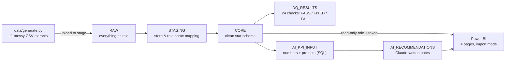

# Harbourline Grill: Restaurant Operations Analytics

An end-to-end BI project for a fictional 10-location casual-dining chain in Metro Vancouver:
messy source extracts → a Snowflake pipeline with data-quality checks → a 4-page Power BI dashboard
→ recommendations with a dollar value, plus a short note per store written by Claude.

> **All data is synthetic.** It was generated with a seeded Python script (`data/generate.py`) that builds in
> realistic patterns *and* realistic problems (duplicates, inconsistent store names, missed clock-outs,
> wrong units), so the pipeline has something to clean and the dashboard has something to find.


---

## What the dashboard finds

Every page follows the same flow: **what happened → where → why → what to do.**

| Page | Question | Finding (2026 YTD) |
|---|---|---|
| **Overview** | Are we OK? | Net sales **$50.9M**, up about **7%** like-for-like (traffic +3%, average check +4%). Labour and food cost look on target at chain level. |
| **Labour** | Where and when is labour off? | The chain is on target (29.8%), but **Coquitlam Centre on Mondays runs 42% labour**. Mondays get Friday's staffing hours with Tuesday-level guest counts. |
| **Food & Menu** | Why is actual food cost above the recipes? | A **$683K** gap between recipe cost and actual cost: 55% is supplier price, the rest is waste and unexplained usage. Drilling in shows **Guildford → Tomato → from March: 28% over recipe** vs 7.7% chain-wide. The #1 burger is a low-margin "Plowhorse". |
| **Recommendations** | So what? | Three actions worth about **$320K a year**, each with an owner and a measure, and a Claude-written note for each store that changes with the Location slicer. |

| Labour | Food & Menu | Recommendations |
|---|---|---|
|  |  |  |

---

## Architecture



**Design choices**
- **Three layers.** RAW holds data exactly as received, all as text, so a load never fails on a bad value. STAGING maps messy names to master data. CORE is the typed star schema Power BI reads.
- **Nothing is fixed silently.** Imputed values carry a flag (`IS_NET_SALES_IMPUTED`, `IS_CLOCK_OUT_IMPUTED`), unmapped rows are kept and counted (LEFT JOINs), and every run logs its data-quality checks.
- **Keys enforced in the ETL.** Snowflake doesn't enforce primary keys, so each fact table is de-duplicated on its grain with `QUALIFY ROW_NUMBER() OVER (PARTITION BY <grain>) = 1`.
- **Least privilege.** Power BI connects as a service user with a read-only role (`BI_READER`) and a token, never a personal login.
- **The AI writes sentences, not numbers.** SQL computes every figure and builds the prompt; Claude only turns the figures into a 3-sentence note. The prompt is stored next to each answer so any note can be audited.

---

## Data quality

`snowflake/04_data_quality.sql` logs 24 checks on every run: **15 PASS** (rules that must be zero) and **9 FIXED** (known source problems the pipeline repaired, with counts). For example:

| Problem in the source extracts | What the pipeline does |
|---|---|
| 2,210 duplicate POS sales rows | Removed on the table's grain |
| Store names like `KITS`, `DT Robson`, trailing spaces, CAPS | Mapped to master data via `STAGING.STORE_ALIAS` |
| Dates as `04-Mar-2025` mixed with ISO dates | Parsed with `TRY_TO_DATE` in both formats |
| Missing net sales | Rebuilt as gross − discounts − comps, and flagged |
| Missed clock-outs | Set to the scheduled end, and flagged |
| 439 produce deliveries in lb instead of kg | Converted, and flagged |

A monthly reconciliation compares source sales to clean sales so the differences are explained, not hidden.

---

## About the Claude notes

`snowflake/06_ai_recommendations.sql` is the production design: Snowflake Cortex calls Claude with `AI_COMPLETE`, inside the warehouse, on a schedule.
**Snowflake trial accounts block Cortex AI functions**, so for this demo `06b_ai_recommendations_trial.sql` was used instead: Snowflake still computes the numbers and builds the exact prompts, the prompts were run through Claude outside Snowflake, and the answers were loaded into the same table. The `MODEL` column says so on every row.

---

## Repository

```
data/
  generate.py            synthetic data generator (seed 29) → data/raw/ and data/clean/
  validate.py            74 consistency checks on the generated data
  DATA_DICTIONARY.md     tables, grains, keys, planted patterns and planted data issues
snowflake/
  01_setup.sql … 05_powerbi_access.sql   warehouse, load, transform, data quality, Power BI access
  06_ai_recommendations.sql              Claude notes via Cortex (needs a paid account)
  06b_ai_recommendations_trial.sql       trial-account version used for this demo
  README.md              how to run it
powerbi/
  Harbourline_Grill_Dashboard.pbix       the dashboard (Power BI Desktop, Windows)
  Harbourline_Grill_Dashboard.pdf        PDF export, for viewing without Power BI
  theme/                 custom navy theme
  README.md              model, key DAX measures, how to open it
docs/images/             screenshots
```

## Run it yourself

1. **Generate the data** (about 1 minute; CSVs aren't committed because they total ~155 MB):
   ```bash
   pip install -r requirements.txt
   python data/generate.py     # writes data/raw/ (messy) and data/clean/ (star schema)
   python data/validate.py     # optional: 74 checks
   ```
2. **Snowflake:** follow `snowflake/README.md` (a free trial account is enough for scripts 01–05 and 06b).
3. **Power BI:** open `powerbi/Harbourline_Grill_Dashboard.pbix` in Power BI Desktop. The data is imported into the file, so every page works offline; only **Refresh** needs a Snowflake connection.

## Tools
Python (pandas, NumPy) · Snowflake SQL · Power BI (DAX, Power Query) · Snowflake Cortex / Claude

---

Built by **Jrae Barker**.
